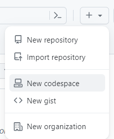
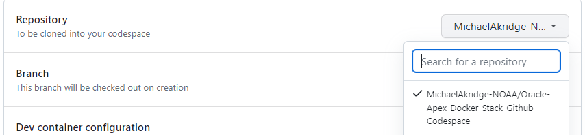
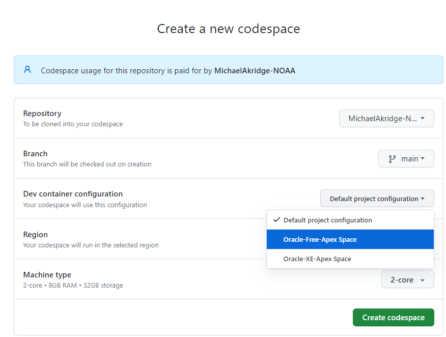
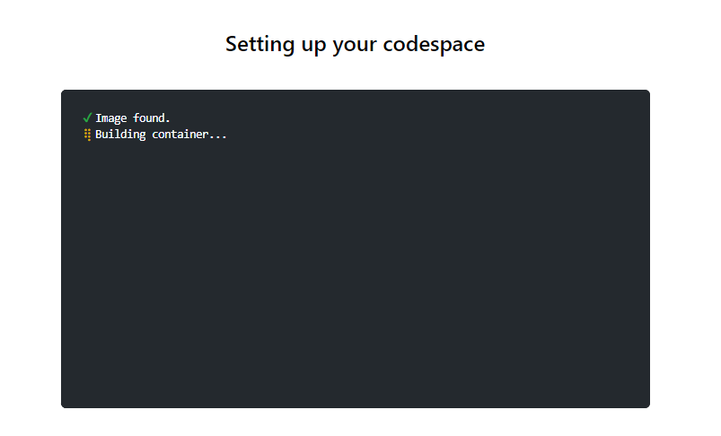
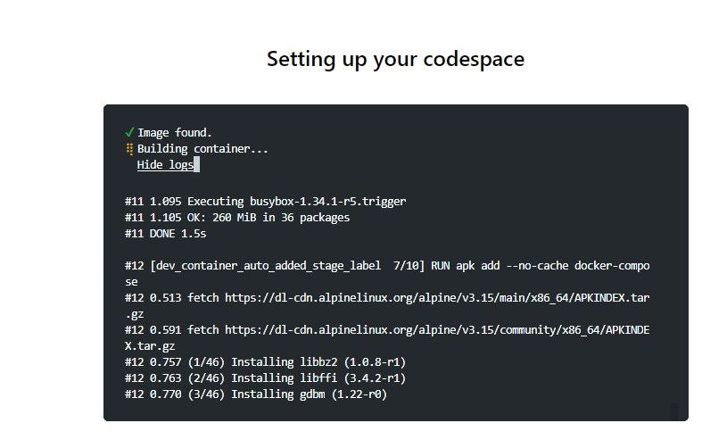

# Oracle Free Database & ORDS-Apex using Github Codespace Setup

This repo will setup a temporary development Codespace that deploys an Oracle Free(or XE, etc) database and ORDS/Apex application for development and testing. Configs are defined in the `devcontainer.json` file & associated Docker and Docker Compose files. Workflow can be applied to other docker deployed apps and additional data can be added and/or installed.
# Table of Contents
1. **[Quick Start](#quick-start)**
2. **[Prerequisites](#prerequisites)**
3. **[Config Breakdown](#configuration-breakdown)**
4. **[Deploy Codespace](#deploy-codespace)**
5. **[Startup](#startup)**
6. **[Access Database & Apex](#access-database--apex)**
7. **[Start/Stop Codespace](#configuration-breakdown)**
8. **[Disclaimer](#disclaimer)**
9. **[License](#license)**
***
## Quick Start
1. Review Prerequisites, and ensure that all have been satisfied before proceeding.
2. Clone the repository.
3. Navigate to Github codespace.
	- https://github.com/codespaces
4. Select 'New Codespace' and repository cloned in step 1.
5. The codespace will initialize itself by building the container based on the provided Dockerfile and start the services based on the `docker-compose.yml` file.

## Prerequisites
1. <mark>Create an Oracle account for access to the Oracle Image Registry (needed for access to Oracle Docker Images)</mark>
	- [Oracle Image/Container Registry](https://container-registry.oracle.com/ords/f?p=113:10)

2. Set the following secret variables via GitHub Secrets([learn more](https://docs.github.com/en/actions/security-guides/using-secrets-in-github-actions)) in the user section for Codespace. Secrets are encrypted environment variables that you create in a repository or organization to store sensitive information.
  - `ORACLE_DOCKER_REGISTRY_USERNAME`: Username for the Oracle container registry.
  - `ORACLE_DOCKER_REGISTRY_PASSWORD`: Password for the Oracle container registry.
  - `ORACLE_PASSWORD`: Set Sys Password for the Oracle Free(or XE)
  - `CONN_STRING`: If using Oracle Free, set connection string for ORDS/Apex. (XEPDB1 for XE and FREEPDB1 for free)
  - `XE_CONN_STRING`: If using Oracle XE, set connection string for ORDS/Apex
```
# Example for Oracle Free
CONN_STRING=sys/<insert-passwrod-here>@database:1521/FREEPDB1

# Example for Oracle XE
CONN_STRING=sys/<insert-passwrod-here>@database:1521/XEPDB1
```


## Configuration Breakdown

### devcontainer.json

- **Docker Build**: Utilizes the `Dockerfile` located one directory above.
  
- **Workspace**: Sets up `/app` as the default directory.
  
- **Ports**: A couple ports are forwarded for access outside the container, including Oracle's port (`1521`) and the ORDS/Apex port (`8181`).
  
- **Commands**: After the container is created, a setup script is executed (`/app/setup_script.sh`) and the Docker registry is logged into using the provided credentials. Install takes time(~20mins). 
  
- **Environment Variables**: Environmental variables for Oracle DB, and Oracle registry are taken from the local repo secrets environment.

### Dockerfile

- **Base Image**: Uses `alpine:3.15.4` as the base image.
  
- **Packages**: Installs essential tools including bash, git, Docker, and Docker Compose.
  
- **Application Setup**: Copies the application files and setup script into the container and makes the script executable. Starts db & apex install. 

### docker-compose.yml

- **Database Service (free-database)**: Sets up an Oracle Free(or XE) container using the `https://hub.docker.com/r/gvenzl/oracle-free` (or xe) image. The Oracle password is taken from an environment variable. Persistent storage for the database is configured with a volume. 

- **ORDS/Apex Service (ords-apex)**: This service depends on the database service being healthy. It uses the Oracle ORDS image from Oracle's container registry(container-registry.oracle.com). Configurations and secrets for ORDS are mounted as volumes.

- **Network**: All services run in the `database-network` network.
## Deploy Codespace





## Startup
1. The system will open up to VS code editor as its installing via docker in the background.


2. To view the progress of the install, use these commands or checkout the log file


- Useful terminal commands
```
#view containers
docker ps
#view container logs
docker logs free-database
docker logs ords-apex
```


## Access Database & Apex
After install,  your application becomes available at the URL based on port forwared in code(8181).  
- https://CODESPACENAME-PORT.app.github.dev
For example:
- https://probable-halibut-p97rvgw99p93rx99-8181.app.github.dev


## Start/Stop Codespace

- You can stop, start, and delete the codespace at anytime on the codespace page: https://github.com/codespaces/
- !!! Note this is a temp dev space. No changes are saved. If there are any persistent data changes you need, you might want to back up the `db-vol` directory, which contains the database data & perform other due diligence.

----------
#### Disclaimer
This repository is a scientific product and is not official communication of the National Oceanic and Atmospheric Administration, or the United States Department of Commerce. All NOAA GitHub project content is provided on an ‘as is’ basis and the user assumes responsibility for its use. Any claims against the Department of Commerce or Department of Commerce bureaus stemming from the use of this GitHub project will be governed by all applicable Federal law. Any reference to specific commercial products, processes, or services by service mark, trademark, manufacturer, or otherwise, does not constitute or imply their endorsement, recommendation or favoring by the Department of Commerce. The Department of Commerce seal and logo, or the seal and logo of a DOC bureau, shall not be used in any manner to imply endorsement of any commercial product or activity by DOC or the United States Government.

##### License
See the [LICENSE.md](./LICENSE.md) for details

#### Feedback & Contributions
New to codespaces, so feedback & contributions are welcome.
