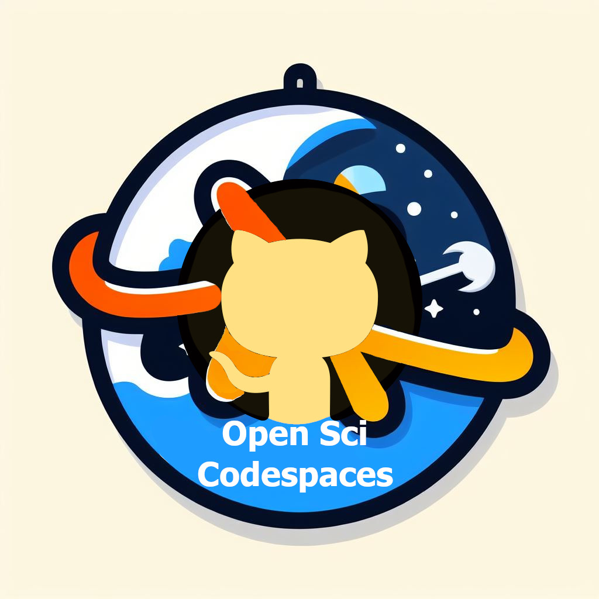
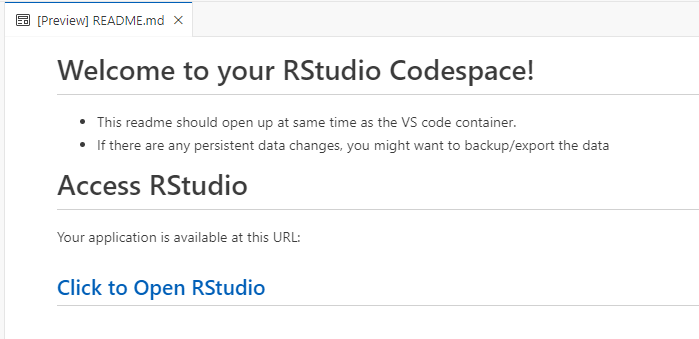
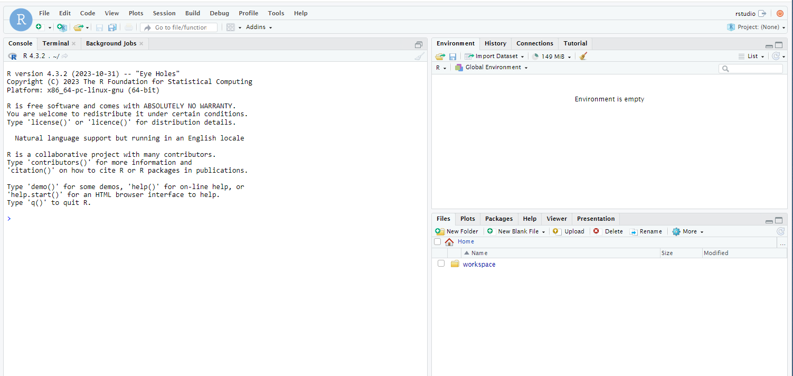
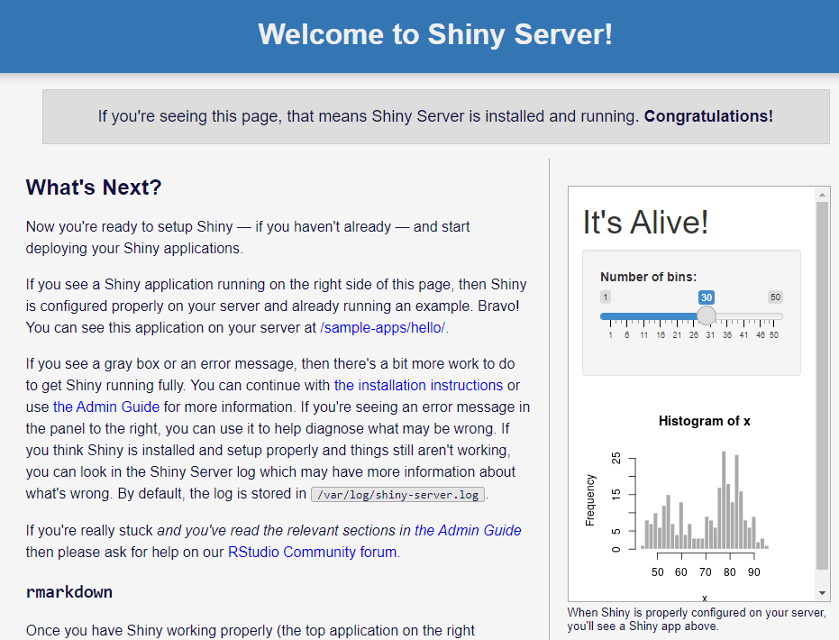
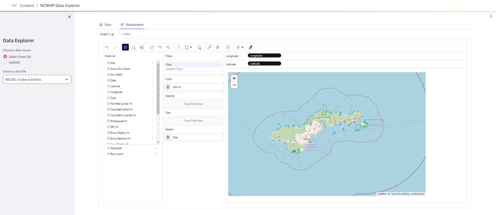
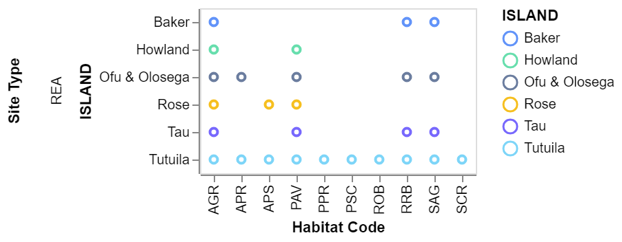

# Open Science Codespaces

Quick & Easy Cloud Working Environments(Codespaces). This repo setups Github Codespaces for R/RStudio, python and more. These can be used for
- Reproducible Science Setups
- Workshops
- Portable Development
- and more!

### Contact
- Michael.Akridge@noaa.gov

### List of Codespaces
1. **[R Codespaces](#r-codespaces)**
    - RStudio
    - Tidyverse
    - Verse
    -  Geospatial
    - Shiny Server
    - [Environmental Data Summary (EDS) Codespace](https://github.com/MichaelAkridge-NOAA/ncei_eds_codespace)
2. **[Python Codespaces](#python-codespaces)**
    - [Python Streamlit App Example | Data Explorer & Viz Tool](#python-codespaces)
    - [Other Python Codespaces](#links-to-various-python-based-codespaces)
4. **[Resources, Links & More Info](#resources-more-info)**

### Looking for More? Try the Codespace Designer

- Use to configure a GitHub Codespace environment
- Powered by Github Pages to help design a codespace devcontainer file with NMFS-Opensci data science images
  - Link: https://michaelakridge-noaa.github.io/codespace-designer/
***

# R Codespaces

Just click the button below to quickly start a codespace:

| Codespace   | QuickStart Link  | Description | 
| ----------- | ----------- |----------- |
| RStudio |    |  Adds RStudio Server. Install R from source and set RSPM as default CRAN mirror	|
| RStudio Tidyverse |    |Adds tidyverse packages & devtools. R packages for data science | 
| RStudio Verse |   | Adds tex & publishing-related package to tidyverse | 
| RStudio Geospatial |      | Adds geospatial packages | 
| RStudio Shiny Server|    | Adds shiny server | 

### Screenshots 

***
# [Environmental Data Summary (EDS) Codespace](https://github.com/MichaelAkridge-NOAA/ncei_eds_codespace)

RStudio Github Codespace with EDS project files. The EDS allows users to download/filter/extract/summarize large amounts of gridded and tabular data given user-defined time stamps and geographical coordinates. The various external environmental data summarized at individual survey sites can aid scientists to assess and understand how living marine resources are impacted by the environmental variabilities. 
## [(Learn More)](https://github.com/MichaelAkridge-NOAA/ncei_eds_codespace)

***
# Python Codespaces
## Streamlit Python App Codespace Example | Data Explorer & Viz Tool

- Exploratory Data Analysis & Visualization Tool. 
- Allows users to explore and visualize recent NOAA's National Coral Reef Monitoring Program(NCRMP) data or upload their own.
- This codespace example runs a python Streamlit App with Pygwalker(https://github.com/Kanaries/pygwalker) for data analysis and data visualization.

## Links to various python based codespaces.

| Codespace  | QuickStart Link | Description | 
| ----------- | ----------- |----------- |
| Jupyter Notebook  |   |[github/codespaces-jupter](https://github.com/github/codespaces-jupyter) | 
| Jupyter Data Science  |  |[devcontainers-community/jupyter-datascience-notebooks](https://github.com/devcontainers-community/templates-jupyter-datascience-notebooks) | 
| Flask  |  | [github/codespaces-flask](https://github.com/github/codespaces-flask)| 
| Anaconda  |  | [devcontainers/templates/anaconda](https://github.com/devcontainers/templates/tree/main/src/anaconda)| 
| Datascience Py & R  |   | [microsoft/datascience-py-r](https://github.com/microsoft/datascience-py-r)| 
***
# Resources & More Info
## Codespaces/Docker
- About Github Codespaces: https://github.com/features/codespaces
- About using images, dockerfiles, compose, and devcontainers: https://containers.dev/guide/dockerfile
- About Docker: https://docs.docker.com/

## Python
- Streamlit (https://streamlit.io/) turns data scripts into shareable web apps
- Pygwalker(https://github.com/Kanaries/pygwalker)  for data analysis and data visualization

## R
- The R codespaces use the images from the Rocker Project. For more info, please visit:
  - https://rocker-project.org/images/
  - https://hub.docker.com/u/rocker

----------
#### Disclaimer
This repository is a scientific product and is not official communication of the National Oceanic and Atmospheric Administration, or the United States Department of Commerce. All NOAA GitHub project content is provided on an ‘as is’ basis and the user assumes responsibility for its use. Any claims against the Department of Commerce or Department of Commerce bureaus stemming from the use of this GitHub project will be governed by all applicable Federal law. Any reference to specific commercial products, processes, or services by service mark, trademark, manufacturer, or otherwise, does not constitute or imply their endorsement, recommendation or favoring by the Department of Commerce. The Department of Commerce seal and logo, or the seal and logo of a DOC bureau, shall not be used in any manner to imply endorsement of any commercial product or activity by DOC or the United States Government.

##### License
See the [LICENSE.md](./LICENSE.md) for details
