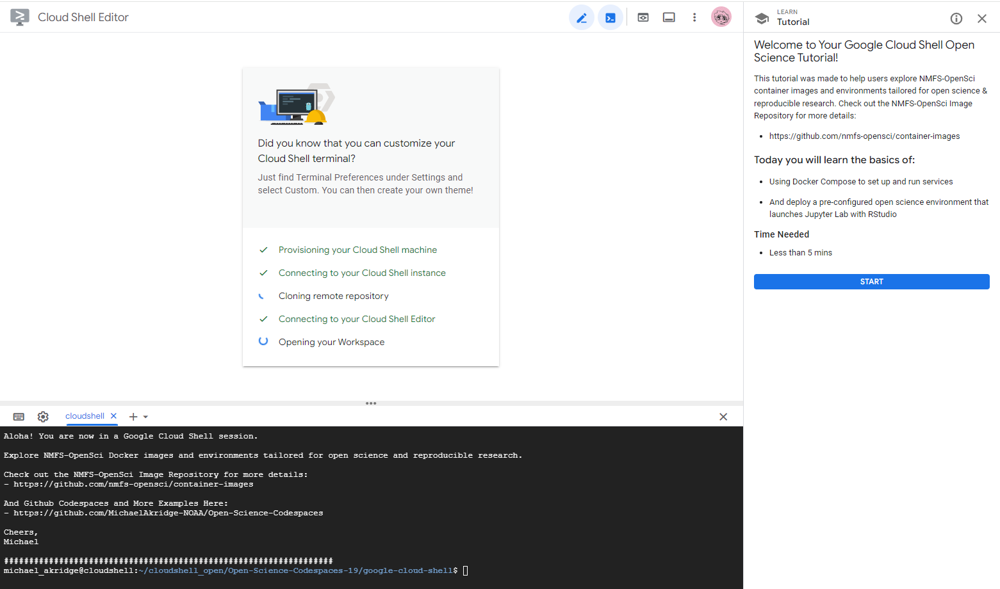
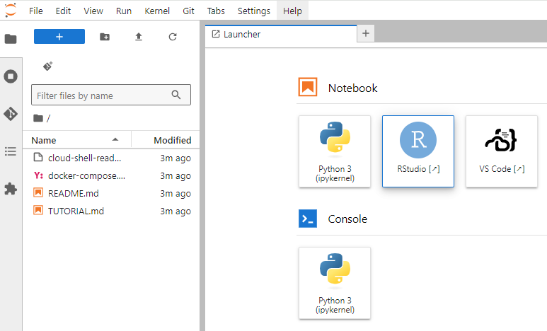

# Open Science - Google Cloud Shell Tutorial
This tutorial was made to help users explore Google Cloud & NMFS-OpenSci container image environments tailored for open science & reproducible research. Check out the NMFS-OpenSci Image Repository for more details:
- https://github.com/nmfs-opensci/container-images

## Start the Google Cloud Shell Tutorial
### Tutorial 01: How to Run a Jupyterlab w/ RStudio (py-rocket-base) Environment
- Time to complete: ~ 3 mins

#### Screenshots

### Tutorial 02: Want more? Email me ideas, and Let me know
- michael.akridge@noaa.gov

### More info on Google Cloud Shell:
- https://cloud.google.com/shell/docs/how-cloud-shell-works
- https://cloud.google.com/shell/docs/open-in-cloud-shell
- https://cloud.google.com/shell/docs/configuring-cloud-shell#environment_customization
